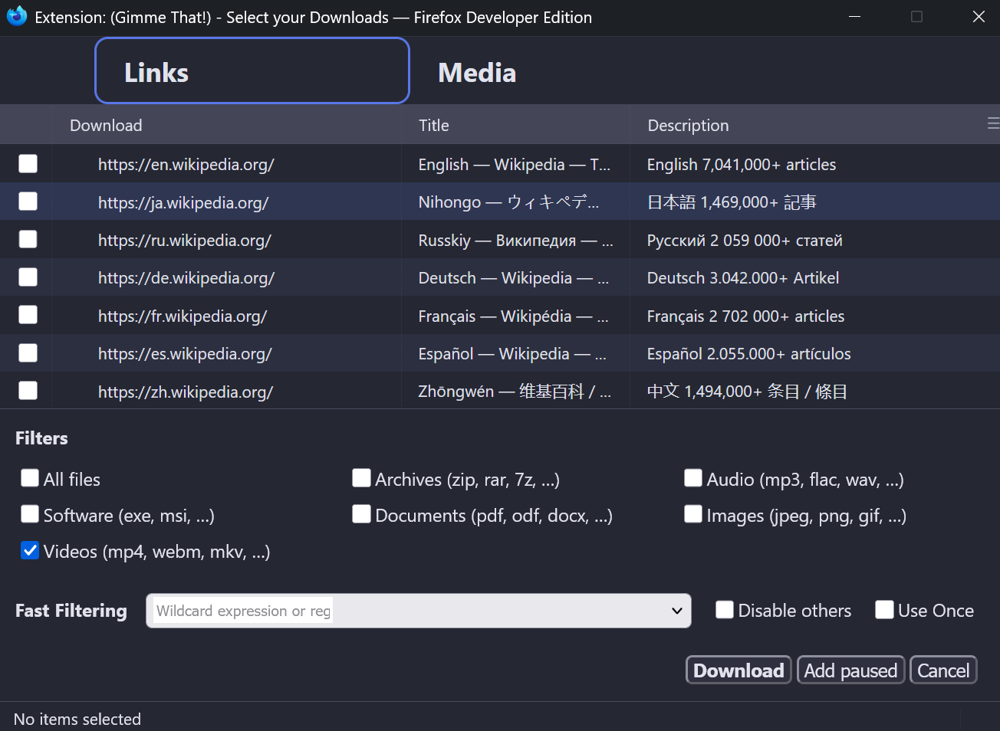
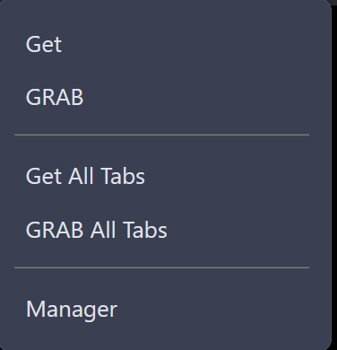

# Gimme That! ! – The Minimal Mass Downloader for Your Browser

## Description
A truly **user-focused**, fast, and hassle-free mass downloader for your browser. Designed to be lean, intuitive, and free of clutter, Gimme That! ! puts downloading in your hands—no distractions, just efficient downloading.

Gimme That! !’s philosophy: **Less is more. The core features you need, nothing you don’t.** This approach ensures a **minimal, clean, and efficient** mass downloader.

## Links
- [Github](https://github.com/moodynooby/Gimme-That)
- [Firefox Store](https://addons.mozilla.org/en-US/firefox/addon/gimmethat/)

## Features
*   **User-focused**: Designed for a hassle-free mass downloading experience.
*   **Lean and Efficient**: Minimal, clean, and efficient with only core features.
*   **Fast**: Optimized for speed.
*   **Modernized Interface**: Settings page updated for clarity and ease of use.
*   **Integrated Experience**: Utilizes native tooltips and sounds.

## Demo / Screenshots



## Setup

### Requirements
*   [node](https://nodejs.org/en/)
*   [yarn](https://yarnpkg.com/)
*   [python3](https://www.python.org/) ≥ 3.6 (for zip builds)
*   [web-ext](https://www.npmjs.com/package/web-ext) (if developing in Firefox)

### Installation
Install dependencies first with:
```bash
yarn
```

### Making Changes
Edit the files using any code editor. To watch for changes and re-bundle automatically, run:
```bash
yarn watch
```
For a one-time build, use:
```bash
yarn build
```

### Running in Firefox
Install `web-ext` separately (not as a dependency). Then, run:
```bash
yarn webext
```
This uses a separate Firefox profile in `../GT.p` and automatically reloads the extension upon changes.
For unsigned builds, run:
```bash
yarn build`
Then install the generated zip into Firefox Nightly or Unbranded builds.

### Running in Chrome/Chromium
After building:
*   Enable Developer Mode in Extensions.
*   Use "Load Unpacked" to open your build directory.

### Making Release Zips
Create unsigned zips for all browsers with:
```bash
yarn build
```
For official release mode:
```bash
python3 util/build.py --mode=release
```
Outputs go in `web-ext-artifacts`.
*   `-fx.zip`: Firefox
*   `-crx.zip`: Chrome/Chromium
*   `-opr.zip`: Opera

## Release Notes

### v4.99
The extension is being rebranded and rewritten to better emphasize its **simplicity** and **minimal, hassle-free experience** to be more user-focused while maintaining a modern, developer-focused appeal.

### v2.6
With this update, Gimme That! ! becomes faster, lighter, and more focused on a seamless user experience.

*   Optional locales removed for greater speed and less bloat.
*   Settings page fully modernized for clarity and ease.
*   Native tooltips and sounds replace custom features, keeping things simplified and integrated.

## License
This project is licensed under the GPL-3.0 License. See the `LICENSE-gpl.txt` file for details.